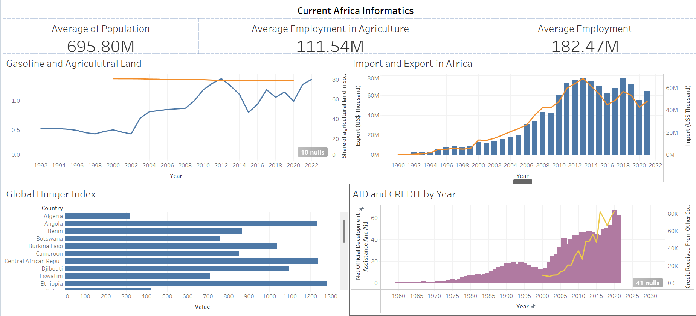
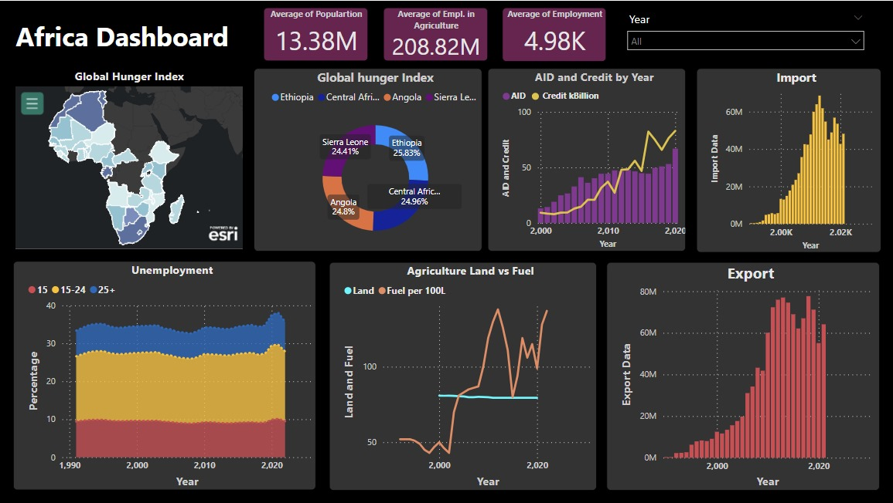
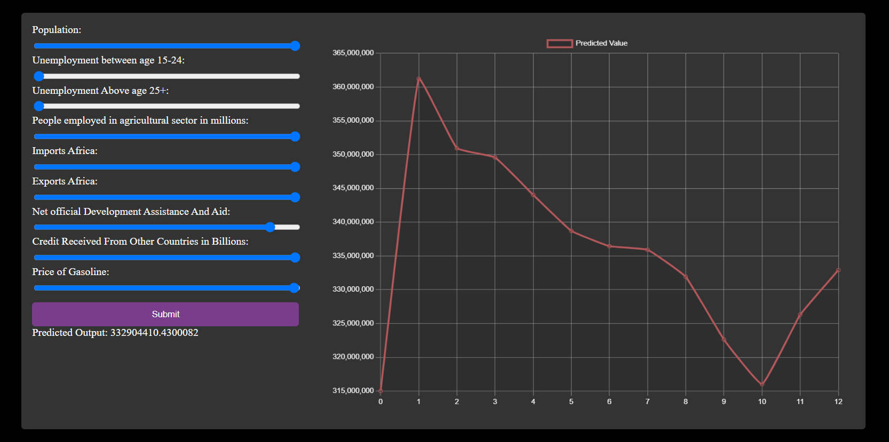

# TeraFeed

## Overview

#### Terafeed - Addressing Zero Hunger in Africa

In the persistent struggle against hunger in Africa, traditional methods of food distribution have fallen short in addressing the root causes of food insecurity. Recognizing the limitations of existing approaches, our project, titled "TeraFeed," embarks on an innovative quest to revolutionize the fight against hunger. By harnessing the power of modern visualization techniques and predictive analytics, we aim to provide stakeholders with a comprehensive understanding of the complex factors contributing to food insecurity in the region. Our objective is to uncover deeper insights into the socioeconomic and environmental variables shaping hunger, including agricultural accessibility, fuel prices, and employment rates. Through cutting-edge data analysis and machine learning algorithms, we seek to forecast future trends in hunger and empower stakeholders to formulate targeted responses. In this introductory section, we lay the foundation for our project's approach, highlighting the critical need for data-driven strategies to reduce hunger and promote sustainable development in Africa.

## About the Project?

### Objective:

The primary objective of TeraFeed is to provide stakeholders, including NGOs, governments, and organizations committed to alleviating hunger, with a comprehensive understanding of the intricate processes underlying food insecurity in Africa. By leveraging cutting-edge data analytic methods and machine learning algorithms, the project aims to forecast future patterns in hunger, enabling stakeholders to formulate targeted responses and interventions.

### Approach:

TeraFeed employs a multi-faceted approach that combines data analysis, predictive modeling, and interactive visualization. The project begins with the identification and gathering of relevant data points, encompassing factors such as agricultural productivity, transportation costs, and import-export dynamics. Advanced data cleaning techniques are then applied to ensure the reliability and consistency of the datasets.

Using machine learning algorithms and statistical models, TeraFeed analyzes historical data to predict future trends in hunger. Linear regression and random forest regression models are employed to quantify the relationships between different factors and anticipate future outcomes. The project also develops a user-friendly website equipped with interactive sliders, allowing stakeholders to manipulate variables and assess their impact on food security in real-time.

### Results:

The results of TeraFeed's analysis provide valuable insights into the drivers of hunger in Africa, highlighting the impact of factors such as fuel prices, agricultural productivity, and unemployment rates. Predictive models generated by the project offer estimates for future trends in hunger, enabling stakeholders to anticipate challenges and formulate informed strategies for intervention.

### Conclusion:

TeraFeed represents a significant advancement in the fight against hunger in Africa, offering a data-driven approach to understanding and addressing food insecurity. By leveraging predictive analytics and interactive visualization, the project empowers stakeholders to make informed decisions and work towards sustainable solutions. TeraFeed envisions a future where hunger is eradicated, and African communities thrive economically and socially.

## Demo

## Screenshots
  
  

## Contributions 

## Contributors 
  - [Hayden Cordeiro](https://hayden.co.in/) 
  
  

- [Jivin Varghese Porthukaran](https://jivin.co.in/) 
  
  
